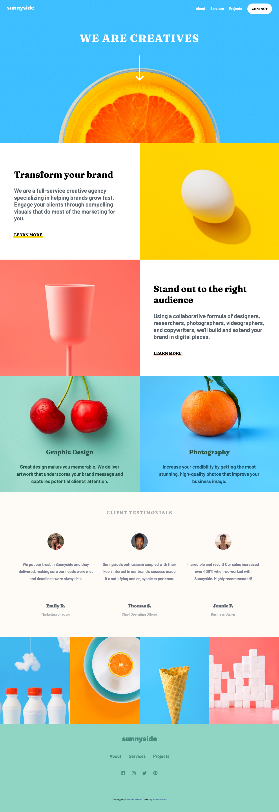
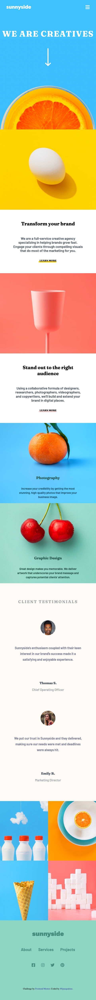

# Projet : Agence Créative Sunnyside

## **À propos du projet**

Sunnyside est une agence créative à service complet spécialisée dans l'aide à la croissance rapide des marques. Ce projet est une page de destination pour l'agence Sunnyside, utilisant 'Frontend Mentor' comme source d'inspiration.

### **Technologies et outils utilisés**

* HTML
* CSS

## **Captures d'écran**

***Bureau** 

***Mobile**

  
  

